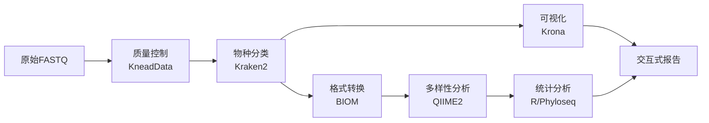

# MICOS-2024: 宏基因组综合分析套件
*Metagenomic Intelligence and Comprehensive Omics Suite*

<div align="center">


[](https://opensource.org/licenses/MIT)
[](https://hub.docker.com/)
[](https://openwdl.org/)
[](https://qiime2.org/)
[](https://ccb.jhu.edu/software/kraken2/)
[](https://github.com/BGI-MICOS/MICOS-2024)

**"猛犸杯"生物信息学竞赛参赛项目**

[快速开始](#快速开始) • [核心功能](#核心功能) • [安装指南](#安装指南) • [使用文档](#文档)

</div>

---

## 项目概述

MICOS-2024是一个专为宏基因组学研究设计的综合分析平台，旨在解决宏基因组数据分析中的复杂性和可重现性挑战。该平台整合了多个经过验证的生物信息学工具，提供从原始测序数据到生物学洞察的完整分析流程。

### 主要特性

- **标准化工作流**：基于WDL的可重现分析流程
- **容器化部署**：Docker/Singularity支持，确保环境一致性
- **模块化设计**：灵活的分析组件，支持自定义流程
- **多样化输出**：丰富的可视化图表和统计报告
- **高性能计算**：优化的并行处理，支持HPC环境

## 核心功能

### 分析流程



### 主要组件

| 功能模块 | 工具 | 版本 | 描述 |
|:---:|:---:|:---:|:---|
| **质量控制** | KneadData/FastQC | v0.12.0 | 宿主DNA去除和序列质量过滤 |
| **增强质量控制** | 自定义Python模块 | v1.0.0 | 高级质量评估和可视化 |
| **物种分类** | Kraken2 | v2.1.3 | 基于k-mer的快速分类学分类 |
| **多样性分析** | QIIME2 | 2024.5 | Alpha/Beta多样性计算和统计检验 |
| **差异丰度分析** | DESeq2/ALDEx2/ANCOM-BC | - | 多种差异分析方法 |
| **功能注释** | KEGG/COG/Pfam | - | 功能基因注释和通路分析 |
| **系统发育分析** | FastTree/MUSCLE | - | 系统发育树构建和分析 |
| **16S rRNA分析** | DADA2/QIIME2 | - | 扩增子序列分析流程 |
| **宏转录组分析** | Salmon/DESeq2 | - | RNA-seq数据分析和功能注释 |
| **网络分析** | NetworkX/igraph | - | 微生物共现网络构建和分析 |
| **可视化** | Krona/Plotly | v2.8.1 | 交互式分类学组成图表 |
| **统计分析** | R/Phyloseq | - | 高级统计分析和可视化 |

### 技术特性

- **工作流管理**：WDL工作流引擎，支持断点续传和错误恢复
- **并行计算**：多线程处理，支持HPC集群部署
- **容器化**：Docker/Singularity支持，确保环境隔离
- **可扩展性**：模块化设计，便于集成新的分析工具
- **可重现性**：版本锁定和容器化确保结果一致性
- **标准兼容**：输出格式兼容QIIME2、Phyloseq、LEfSe等主流工具

## 性能基准

| 数据集规模 | 样本数量 | 处理时间 | 内存使用 |
|:---:|:---:|:---:|:---:|
| 小型 | 10个样本 | ~2小时 | 16GB |
| 中型 | 50个样本 | ~8小时 | 32GB |
| 大型 | 100个样本 | ~15小时 | 64GB |

*基准测试基于标准Kraken2数据库，使用16核CPU环境*

## 快速开始

### 系统要求

- **操作系统**: Linux (Ubuntu 20.04+) 或 macOS
- **内存**: 最少16GB，推荐32GB+
- **存储**: 至少100GB可用空间
- **CPU**: 多核处理器，推荐16核+

### Docker安装（推荐）

```bash
# 克隆项目
git clone https://github.com/BGI-MICOS/MICOS-2024.git
cd MICOS-2024

# 启动核心分析服务（示例 Compose）
docker compose -f deploy/docker-compose.example.yml up -d

# 运行测试
./scripts/run_test_data.sh
```

### Conda安装

```bash
# 安装Miniforge
wget https://github.com/conda-forge/miniforge/releases/latest/download/Miniforge3-Linux-x86_64.sh
bash Miniforge3-Linux-x86_64.sh

# 创建环境
git clone https://github.com/BGI-MICOS/MICOS-2024.git
cd MICOS-2024
mamba env create -f environment.yml
conda activate micos-2024

# 验证安装
./scripts/verify_installation.sh
```

## 项目结构 (Project Structure)

```
.
├── .gitignore
├── README.md
├── LICENSE
├── CONTRIBUTING.md
├── CODE_OF_CONDUCT.md
├── SECURITY.md
├── changelog/
│   └── 2025-10-20_open_source_refactor.md
├── deploy/
│   └── docker-compose.example.yml
├── micos/
│   └── ...
├── scripts/
│   ├── run_full_analysis.sh
│   ├── run_module.sh
│   ├── verify_installation.sh
│   └── ...
├── legacy/
│   └── r-scripts/
├── containers/
│   └── singularity/
│       ├── pandas.def
│       └── ubuntu.def
├── workflows/
│   ├── origin-HUMAnN.wdl
│   └── wdl_scripts/
├── config/
│   ├── analysis.yaml.template
│   ├── databases.yaml.template
│   ├── samples.tsv.template
│   └── README.md
├── data/
│   └── raw_input/
├── docs/
│   ├── user_manual.md
│   ├── configuration.md
│   ├── troubleshooting.md
│   ├── taxonomic-profiling.md
│   ├── functional-profiling.md
│   └── images/
├── tests/
│   ├── test_enhanced_qc.py
│   └── test_utils.py
├── pyproject.toml
├── requirements.txt
├── environment.yml
└── .github/
    └── workflows/ci.yml
```

## 安装指南

详细的安装说明请参考：[📖 完整安装指南](docs/user_manual.md#详细安装指南)

### 数据库准备

MICOS-2024 需要以下参考数据库：

- Kraken2 数据库（用于物种分类）
- KneadData 数据库（用于宿主 DNA 去除）
- QIIME2 分类器（用于分类学注释）

请参考 `docs/configuration.md` 获取下载与准备指南，并根据 `config/databases.yaml.template` 填写本地路径。

## 配置

### 配置文件

```bash
config/
├── analysis.yaml        # 分析参数配置
├── databases.yaml       # 数据库路径配置
└── samples.tsv          # 样本元数据
```

### 快速配置

```bash
# 复制配置模板
cp config/analysis.yaml.template config/analysis.yaml
cp config/databases.yaml.template config/databases.yaml
cp config/samples.tsv.template config/samples.tsv

# 编辑配置文件
nano config/analysis.yaml
nano config/databases.yaml
nano config/samples.tsv
```

详细配置说明请参考：[⚙️ 配置指南](docs/configuration.md)

## 使用指南

### 基本用法

```bash
# 1. 准备数据
mkdir -p data/raw_input
cp /path/to/your/*.fastq.gz data/raw_input/

# 2. 配置分析参数
cp config/analysis.yaml.template config/analysis.yaml
# 编辑配置文件...

# 3. 运行完整分析
./scripts/run_full_analysis.sh

# 4. 查看结果
firefox results/reports/analysis_report.html
```

### 模块化运行

```bash
# 基础分析模块
./scripts/run_module.sh quality_control
./scripts/run_module.sh enhanced_qc
./scripts/run_module.sh taxonomic_profiling
./scripts/run_module.sh diversity_analysis

# 高级分析模块
./scripts/run_module.sh differential_abundance
./scripts/run_module.sh functional_annotation
./scripts/run_module.sh phylogenetic_analysis
./scripts/run_module.sh network_analysis

# 专业分析模块
./scripts/run_module.sh amplicon_analysis      # 16S rRNA分析
./scripts/run_module.sh metatranscriptome      # 宏转录组分析

# 可视化和报告
./scripts/run_module.sh visualization
./scripts/run_module.sh report_generation
```

### 工作流运行

```bash
# 使用WDL工作流
java -jar cromwell.jar run \
  workflows/wdl_scripts/meta-dev.wdl \
  --inputs config/analysis.json
```

详细使用说明请参考：[📖 用户手册](docs/user_manual.md)

## 输出结果

### 主要输出

| 类型 | 位置 | 描述 |
|:---:|:---:|:---|
| **分析报告** | `results/reports/` | HTML格式的交互式报告 |
| **质量控制** | `results/quality_control/` | FastQC和MultiQC报告 |
| **增强质量控制** | `results/enhanced_qc/` | 高级质量评估和可视化报告 |
| **物种分类** | `results/taxonomic_profiling/` | Kraken2分类结果和Krona图表 |
| **多样性分析** | `results/diversity_analysis/` | Alpha/Beta多样性指标和图表 |
| **差异丰度分析** | `results/differential_abundance/` | DESeq2/ALDEx2/ANCOM-BC结果 |
| **功能注释** | `results/functional_annotation/` | KEGG/COG/Pfam注释结果 |
| **系统发育分析** | `results/phylogenetic_analysis/` | 系统发育树和进化分析 |
| **16S rRNA分析** | `results/amplicon_analysis/` | 扩增子序列分析结果 |
| **宏转录组分析** | `results/metatranscriptome/` | RNA-seq分析和功能注释 |
| **网络分析** | `results/network_analysis/` | 微生物共现网络和拓扑分析 |
| **统计表格** | `results/tables/` | CSV/TSV格式的数据表 |

### 可视化输出

- **Krona交互式图表**: 分类学组成的层次结构展示
- **多样性分析图**: Alpha/Beta多样性箱线图和PCoA图
- **丰度热图**: 样本间物种丰度比较
- **差异分析图**: 火山图、MA图和差异物种热图
- **功能注释图**: KEGG通路图和GO富集分析
- **系统发育树**: 交互式系统发育树可视化
- **网络图**: 微生物共现网络和模块分析
- **质量控制图**: 序列质量、GC含量和复杂度分析
- **统计检验结果**: 差异分析和生物标志物发现

## 文档

| 文档 | 描述 |
|:---|:---|
| [用户手册](docs/user_manual.md) | 完整的安装和使用指南 |
| [配置指南](docs/configuration.md) | 详细的配置参数说明 |
| [故障排除](docs/troubleshooting.md) | 常见问题和解决方案 |
| [分类学分析](docs/taxonomic-profiling.md) | 物种分类分析流程 |

## 贡献

我们欢迎社区贡献！请查看 [贡献指南](CONTRIBUTING.md) 了解详情。

- **报告问题**: [提交Issue](https://github.com/BGI-MICOS/MICOS-2024/issues)
- **功能建议**: [提交Feature Request](https://github.com/BGI-MICOS/MICOS-2024/issues)
- **代码贡献**: Fork项目并提交Pull Request

## 获取帮助

- **GitHub Issues**: [报告问题](https://github.com/BGI-MICOS/MICOS-2024/issues)
- **GitHub Discussions**: [参与讨论](https://github.com/BGI-MICOS/MICOS-2024/discussions)
- **故障排除**: [查看常见问题](docs/troubleshooting.md)
- **安全策略**: 查看 `SECURITY.md`

## 许可证

本项目采用 [MIT许可证](LICENSE)。

## 致谢

感谢以下开源项目：

- [Kraken2](https://ccb.jhu.edu/software/kraken2/) - 分类学分类
- [QIIME2](https://qiime2.org/) - 微生物组数据分析
- [KneadData](https://github.com/biobakery/kneaddata) - 质量控制
- [Krona](https://github.com/marbl/Krona) - 交互式可视化

---

<div align="center">

**MICOS-2024: 宏基因组综合分析套件**

[](https://github.com/BGI-MICOS/MICOS-2024)

</div>